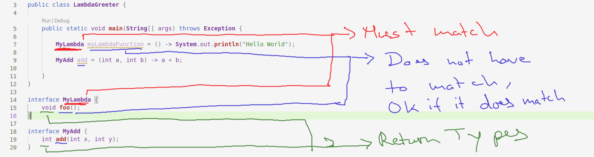

# Java Lambdas

Functional Programming using Java Lambdas, which was introduced in version 8

## Contents

<!-- toc -->

- [Java Lambdas](#java-lambdas)
  - [Contents](#contents)
  - [Thinking in Terms of Objects vs Behaviour](#thinking-in-terms-of-objects-vs-behaviour)
    - [Example](#example)
  - [Lambdas](#lambdas)
  - [Functions as Values](#functions-as-values)
    - [Inline Values](#inline-values)
    - [Lambda Expressions/Functions](#lambda-expressionsfunctions)
    - [Inline functions](#inline-functions)
  - [Complete Syntax: Reusing the Interface](#complete-syntax-reusing-the-interface)
  - [Full Implementaion](#full-implementaion)
  - [Housekeeping](#housekeeping)
    - [Getting Started](#getting-started)
    - [Folder Structure](#folder-structure)
    - [Dependency Management](#dependency-management)

<!-- tocstop -->

## Thinking in Terms of Objects vs Behaviour

In OOP we always have to think everything in terms of Objects (nouns). Ie we code things that can perform tasks and behave in certain ways.

But often times we might just want to code the behaviour itself. That is where Lambdas and functional programming come in.

### Example

> Relevant Files: Person.java, Greeting.java, EnglishGreeting.java & FrenchGreeting.java

Say we want an universal action that can be performed by many different types of objects. For example a greeting performed by a person. Perhaps there can be a variation of this greeting as well.

A way to solve this issue is to create an InterfaceGreeting, Implement it. Then create an object of the implemented class in the Person class and pass to the greet() function. I beleive this is called dependancy injection (double check this).

`EnglishGreeting` and `FrenchGreeting` are implementation of the `Greeting Interface`

Objects of those classes are being passed to the `person's greet() method`

How we still had to create and extra class or thing that could perform the behvaiour via the `perform()` method

We did not pass the behaviour directly to the person, instead we passed in another thing that could perform the behaviour

This is the problem Lambdas and FP fixes

```java
public class Person {
    public void greet(Greeting greeting) {
        greeting.perform();
    }

    public static void main(String[] args) throws Exception {
        Person p1 = new Person();
        EnglishGreeting englishGreeting = new EnglishGreeting();
        FrenchGreeting frenchGreeting = new FrenchGreeting();

        p1.greet(englishGreeting); // Good Morning
        p1.greet(frenchGreeting); // Bonjour
    }
}
```

## Lambdas

So instead we want to pass in the action or behaviour directly without having to create an Object first.

Lambdas or `Lambda Expression` are functions which exist in isolation and are not part of a class

Those functions can be treated as values, `(ie first class functions, I think what he means by that)`

## Functions as Values

The syntax for the java code in this syntax is incorrect, see next section for correct code.

### Inline Values

Objects and values themselves can be assigned to variables

```java
String name = 'foo'

double pi = 3.14

Person p1 = new Person();
```

### Lambda Expressions/Functions

> Now the question is can we assign a block of code to a variable?

Yes and it's basically JS's arrow function but the arrow is `->` instead of `=>`

> We don't need modifiers or return type for Lambda functions. The compiler infers the return type automatically for lambdas

```java
aBlockOFCode = (arguments) -> {
    System.out.println('Hello');
}
```

In case of one liners, don't need `{}` as usual. Also just like in JS the return is implied and we don't have to use `return`

In case of something like `System.out.println('Hello')`, on liners returns a void

```java
aBlockOFCode = () ->  System.out.println('Hello');

doubleNumberFunction = (int a) -> a * 2;

addFunction = (int a, int b) -> a + b;
```

### Inline functions

Basically one half of the idea of a first class function, ie we can pass a function as an argument to another function.

When we write the inner function directly inside the outter function, it's an inline function

```java
greet(()-> System.out.println('Hello'));
```

## Complete Syntax: Reusing the Interface

<p width="800px">
 
</p>

## Full Implementaion

The `Greeting Interface` stays exactly the same

```java
public interface Greeting {
    public void perform();
}
```

The `Person class` can be updated as follows

```java
public class Person {

    public static void main(String[] args) throws Exception {
        Person p1 = new Person();
        Greeting lambdaGreeting = () -> System.out.println("Hello");
        // This is the differnence with JS
        // We have to call lambdaGreeting.perform() instead of lambdaGreeting()
        lambdaGreeting.perform();
    }
}

```

## Housekeeping

This section of the note is part of the auto generated readme created by vscode

### Getting Started

Welcome to the VS Code Java world. Here is a guideline to help you get started to write Java code in Visual Studio Code.

### Folder Structure

The workspace contains two folders by default, where:

- `src`: the folder to maintain sources
- `lib`: the folder to maintain dependencies

Meanwhile, the compiled output files will be generated in the `bin` folder by default.

> If you want to customize the folder structure, open `.vscode/settings.json` and update the related settings there.

### Dependency Management

The `JAVA PROJECTS` view allows you to manage your dependencies. More details can be found [here](https://github.com/microsoft/vscode-java-dependency#manage-dependencies).
